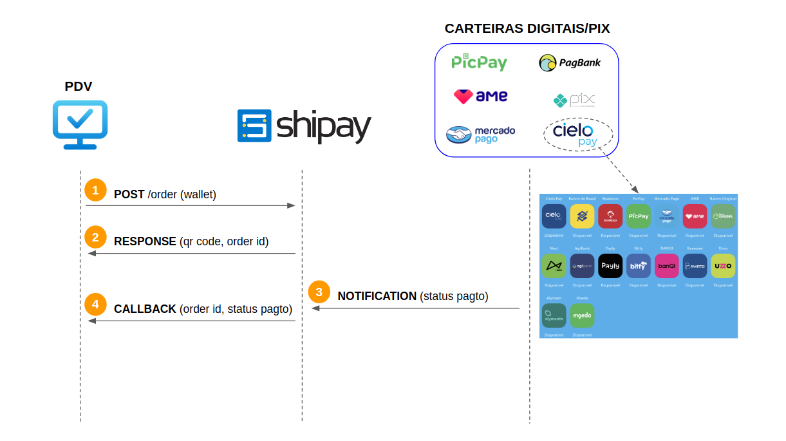

### Fluxo de Operação

 

1. PDV envia pedido informando a carteira escolhida pelo cliente (Mercado Pago, Ame, PicPay, etc.).

2. Shipay responde com o QR Code (base64 e texto) + número do pedido.
> - PDV renderiza QR Code em base64 na tela *(caso o monitor do PDV não esteja visível para o cliente, QR Code em texto é utilizado para impressão)*;
> - Cliente abre app da carteira escolhida, lê o QR Code e faz o pagamento.

3. Carteira notifica a Shipay que o pedido foi pago.

4. **????**

 
